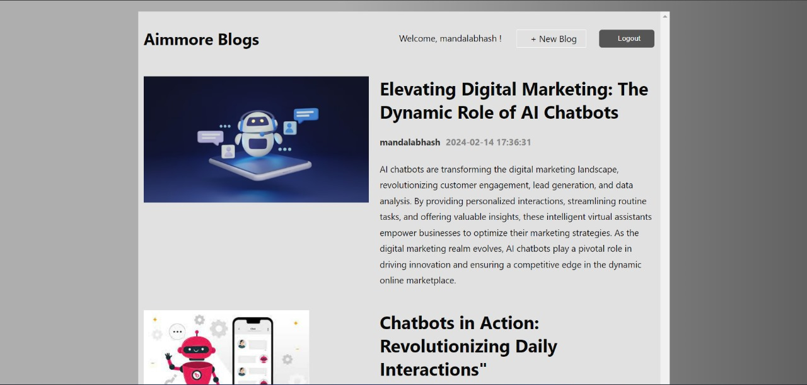
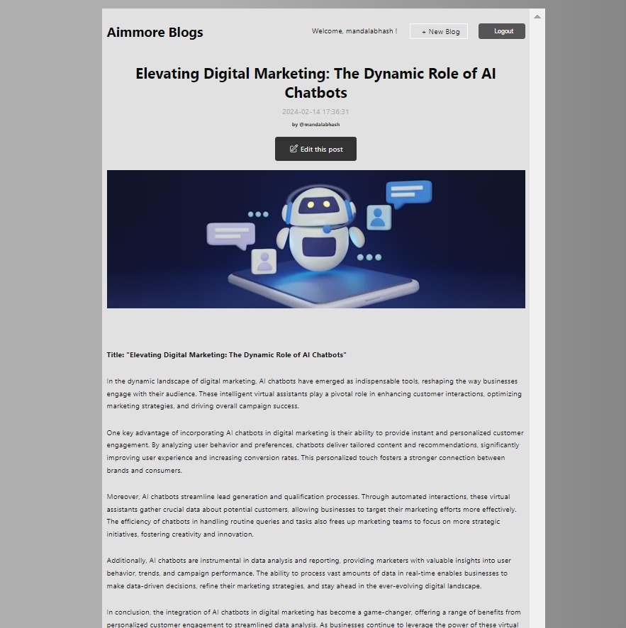
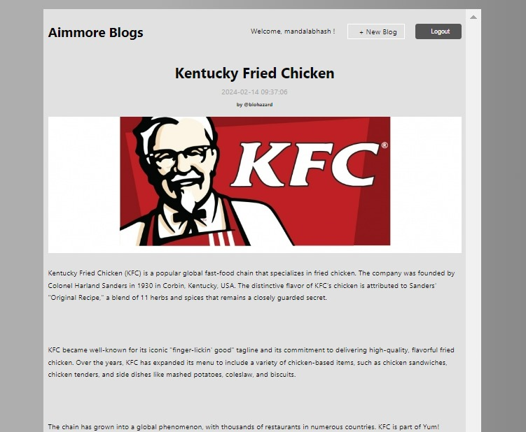
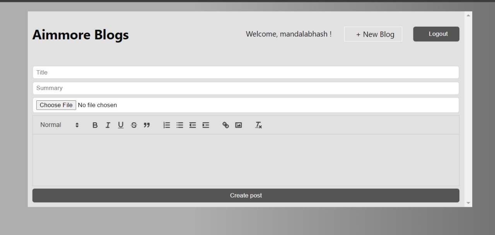
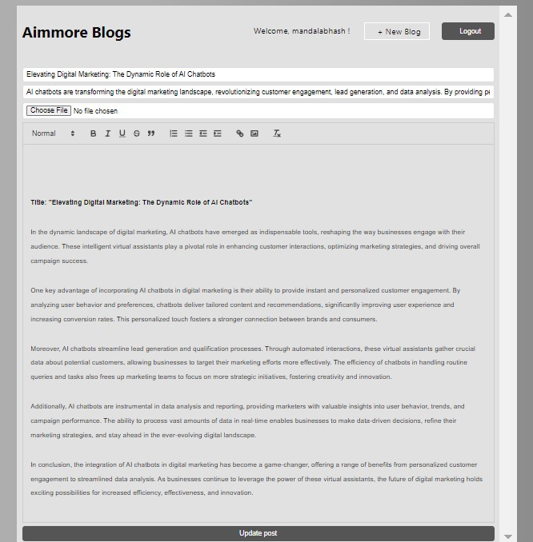
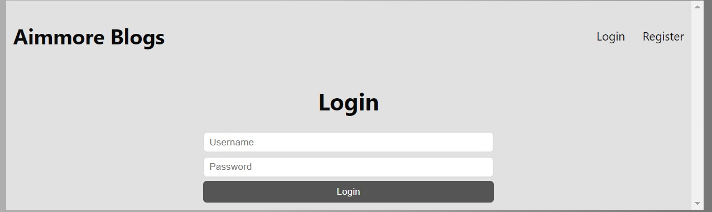
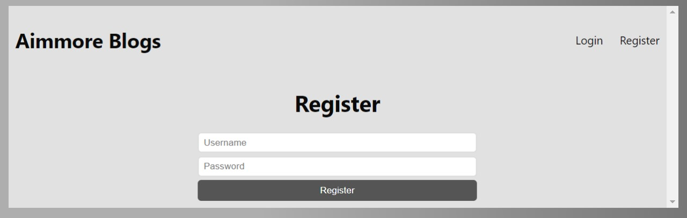

# CipherSchools_Aimmore-Blogs

# AimMore Blogs

Welcome to AimMore Blogs, a stylish and feature-rich blog website developed with React and Node.js frameworks. This project is designed for educational and examination evaluation purposes only and should not be cloned or used for commercial purposes.

## Getting Started

Follow these simple steps to explore the AimMore Blogs project:

1. **Clone the Repository:**
   ```
   git clone <repository-url>
   ```

2. **Install Dependencies:**
   Navigate to the `aimmore-blogs` directory and run the following command to install the required dependencies:
   ```
   npm install
   ```

3. **Configure MongoDB:**
   In the `backend` directory, update the MongoDB connection string in `line 22` with your database information:
   ```javascript
   mongoose.connect('<your-mongodb-string-code>');
   ```

4. **Start the Backend Server:**
   Run the following command in the `backend` directory to start the backend server:
   ```
   npm run start
   ```
   or for debugging purposes:
   ```
   npm run dev
   ```

5. **Launch the Blog App:**
   Run the following command in the `aimmore-blogs` directory to start the blog application on localhost:
   ```
   npm run start
   ```

   Ensure you have Node.js installed with a version greater than or equal to 20.0.0 LTS.

6. **Explore the Blog Website:**
   Open your browser and navigate to [http://localhost:3000](http://localhost:3000) to explore the AimMore Blogs website.

## Screenshots

### 1. Homepage


### 2. Blog Page

Only the Actual Author the Blog can edit his/her blog.


### 3. Blog Creation Page


### 4. Blog Updation Page


### 4. Login and Register Account Pages




## Disclaimer

This project is created by AimMore for educational and examination evaluation purposes only. Any unauthorized use for commercial purposes is strictly prohibited.

## Developer

AimMore - [www.aimmore.in](https://www.aimmore.in)

Feel free to explore the AimMore Blogs and enhance your blogging experience!

Happy Blogging! 🚀
